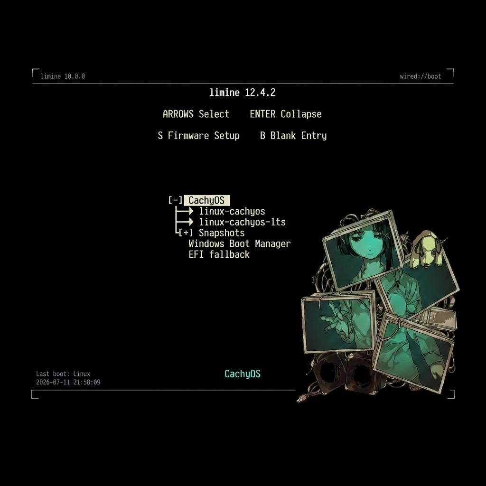

# dotfiles-cachyos

<p align="center">
  <strong>Split View (Four terminal instances showcasing dynamic avatars)</strong><br>
  
</p>

<p align="center">
  <strong>Individual Views (Detailed terminal configurations)</strong><br>
  
  
</p>

---

This repository contains my personal system configuration files and desktop rice for CachyOS Linux (Rolling Release) running KDE Plasma 6.7.3 (Wayland).

---

## Repository Structure

The configuration files are organized in the following tree manner:

```
.
├── alacritty
│   └── alacritty.toml
├── assets
│   ├── fastfetch_grid.png
│   ├── limine_showcase.jpg
│   ├── terminal_preview_1.png
│   └── terminal_preview_2.png
├── fastfetch
│   ├── config.jsonc
│   ├── lain
│   │   ├── 2406ac8850a3cf299aa6e2f221216307.jpg
│   │   ├── bfc238eafb35cbebade94a734959ae30.jpg
│   │   ├── c4632e785b5ebbf9edb786ff7bbfbab0.jpg
│   │   └── lainPfp.jpg
│   └── random_lain.sh
├── fish
│   ├── config.fish
│   ├── fish_plugins
│   ├── fish_variables
│   └── functions
│       └── fisher.fish
├── keyd
│   └── default.conf
├── kitty
│   ├── current-theme.conf
│   ├── images
│   │   ├── 2406ac8850a3cf299aa6e2f221216307.jpg
│   │   ├── bfc238eafb35cbebade94a734959ae30.jpg
│   │   ├── c4632e785b5ebbf9edb786ff7bbfbab0.jpg
│   │   └── lainPfp.jpg
│   ├── kitty.conf
│   └── light-theme.auto.conf
├── limine
│   ├── lain.png
│   └── limine.conf
├── micro
│   └── settings.json
├── vscode
│   └── settings.json
└── zen
    └── userChrome.css
```

---

## Key Highlights

### Kitty Border & Glow Configuration
Designed specifically for Wayland, the terminal features a transparent background (opacity 0.70), border-glow highlights, and removes standard window title decorations:
```ini
background_opacity 0.70
background_blur 128
window_border_width 2.5pt
hide_window_decorations yes
active_border_color #c084fc
inactive_border_color #3b1f4a
```

### Kitty Graphic Images (icat protocol)
Kitty includes a GPU-accelerated graphics protocol allowing images to be drawn directly inside the terminal window. This repository bundles a set of custom avatars in the `kitty/images/` folder.

#### How to display these images directly in Kitty:
You can print any image in full high-resolution directly to your shell window using Kitty's built-in `icat` command:
```bash
# Print a specific avatar to the terminal
kitty +kitten icat ~/dotfiles-cachyos/kitty/images/lainPfp.jpg

# Or if you've symlinked the config:
kitty +kitten icat ~/.config/kitty/images/lainPfp.jpg
```

This protocol is utilized by the custom `fastfetch` command wrapper in Fish shell to show a random graphic logo when system specs are loaded.

> [!NOTE]
> **Copyright Disclaimer:** All image assets bundled inside this repository belong to their respective creators/artists and are included strictly for personal workspace aesthetic demonstrations. No copyright infringement is intended. If you are the owner of any asset and want it removed, please submit an issue or contact the repository owner.

### Dynamic Image fastfetch Logo
Whenever `fastfetch` is run (or a new Kitty terminal window is opened), the custom wrapper function in Fish shell runs a bash script to cycle images:
```fish
function fastfetch
    set img (~/.config/fastfetch/random_lain.sh)
    kitten @ set-font-size 9
    command fastfetch --logo-type kitty-icat --logo $img $argv
    kitten @ set-font-size 14
end
```

The underlying bash script (`fastfetch/random_lain.sh`) rotates the images in a queue to ensure a new image displays on every execution:
```bash
#!/bin/bash

DIR="$HOME/.config/fastfetch/lain"
QUEUE="$HOME/.cache/lain_queue"

mkdir -p "$HOME/.cache"

if [ ! -s "$QUEUE" ]; then
    find "$DIR" -maxdepth 1 -type f \
        \( -iname "*.png" -o -iname "*.jpg" -o -iname "*.jpeg" -o -iname "*.webp" \) \
        | shuf > "$QUEUE"
fi

IMG=$(head -n1 "$QUEUE")
tail -n +2 "$QUEUE" > "$QUEUE.tmp"
mv "$QUEUE.tmp" "$QUEUE"

echo "$IMG"
```
The randomizer relies on a cached local queue (~/.cache/lain_queue) to ensure every image from the fastfetch/lain/ directory is shown once before repeating.

### Keyd Screen Capture Remap
To capture selective screenshots (e.g. via Spectacle/system tools) on print screen press:
The configuration in `keyd/default.conf` binds key inputs globally at the kernel-input level:
```ini
[ids]
*

[main]
selectivescreenshot = print
```

### Zen Browser Transparency
Zen Browser achieves full transparency through the `userChrome.css` custom CSS. Make sure you enable user chrome styling inside Zen settings and install a blur manager such as kwin-effects-better-blur (on KDE Plasma) to enable background blurring. This setup is configured following the guide in https://github.com/agridyne/dotfiles-dt.

### KDE Lock Screen Customization
The lock screen background customization utilizes a dynamic video wallpaper. The setup uses:
*   **Wallpaper Plugin:** Smart Video Wallpaper Reborn (`luisbocanegra.smart.video.wallpaper.reborn`)
*   **Blur Integration:** `better_blur_dx` (via the `kwin-effects-better-blur-dx` effects manager)
This lock screen video configuration was implemented following instructions in https://github.com/agridyne/dotfiles-dt.

### Limine Bootloader
The system uses the Limine bootloader with a custom background image (`limine/lain.png`). Here is the bootloader layout:

<p align="center">
  
</p>

---

## Installation

To apply these configuration files to your own local environment:

1.  **Clone the Repository:**
    ```bash
    git clone git@github.com:Wired-Navi0x17/dotfiles-cachyos.git ~/dotfiles-cachyos
    ```

2.  **Symlink Configurations:**
    ```bash
    # Kitty Terminal (copies settings & image folders)
    ln -sf ~/dotfiles-cachyos/kitty ~/.config/kitty

    # Fish Shell
    ln -sf ~/dotfiles-cachyos/fish ~/.config/fish

    # VS Code settings
    mkdir -p ~/.config/Code/User
    ln -sf ~/dotfiles-cachyos/vscode/settings.json ~/.config/Code/User/settings.json

    # Alacritty Terminal
    ln -sf ~/dotfiles-cachyos/alacritty ~/.config/alacritty

    # Fastfetch settings
    ln -sf ~/dotfiles-cachyos/fastfetch ~/.config/fastfetch

    # Micro settings
    ln -sf ~/dotfiles-cachyos/micro ~/.config/micro

    # Zen userChrome (replace profile name with your active Firefox/Zen profile folder)
    mkdir -p ~/.config/mozilla/firefox/YOUR_PROFILE/chrome
    ln -sf ~/dotfiles-cachyos/zen/userChrome.css ~/.config/mozilla/firefox/YOUR_PROFILE/chrome/userChrome.css
    ```

3.  **Applying Keyd configuration:**
    ```bash
    sudo cp ~/dotfiles-cachyos/keyd/default.conf /etc/keyd/default.conf
    sudo systemctl restart keyd
    ```

4.  **Applying Limine boot settings:**
    > [!IMPORTANT]
    > Limine is a bootloader. Modifying its settings should be done with care. Always back up your system boot configurations before replacement.
    ```bash
    sudo cp ~/dotfiles-cachyos/limine/limine.conf /boot/limine.conf
    sudo cp ~/dotfiles-cachyos/limine/lain.png /boot/lain.png
    ```

---

## Distributor Notes

*   **OS:** CachyOS Linux (Rolling Release, Arch-based)
*   **Desktop Environment:** KDE Plasma 6.7.3
*   **Windowing System:** Wayland
*   **Application Style:** Darkly
*   **Plasma Style:** Ant Dark
*   **Icon Set:** Papirus
*   **Cursor Set:** Catppuccin Frappé Pink
*   **Shell:** Fish (with Fisher plugin manager)
*   **Fonts:** JetBrainsMono Nerd Font
*   **Theme:** Lain Wired
