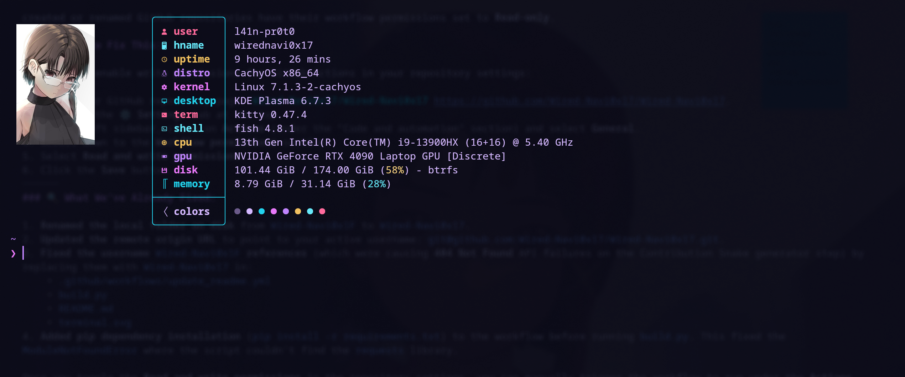
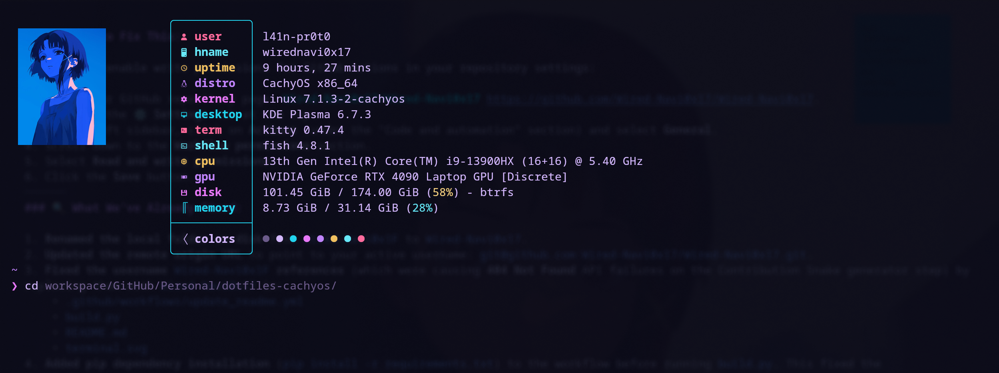
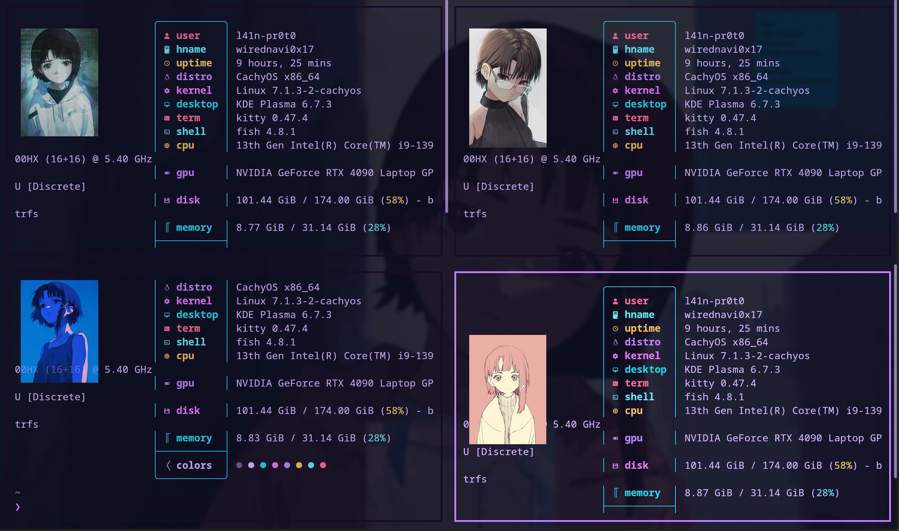
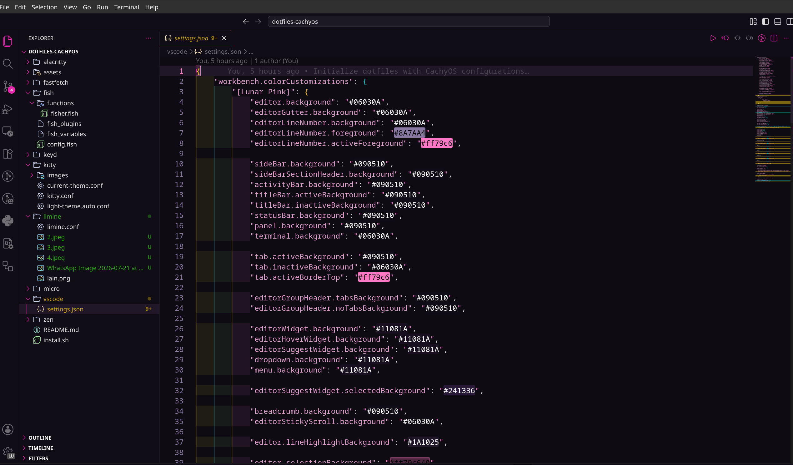
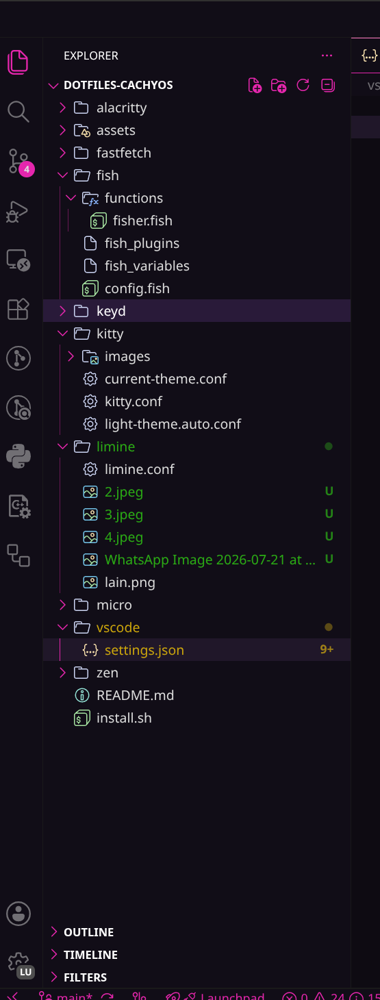
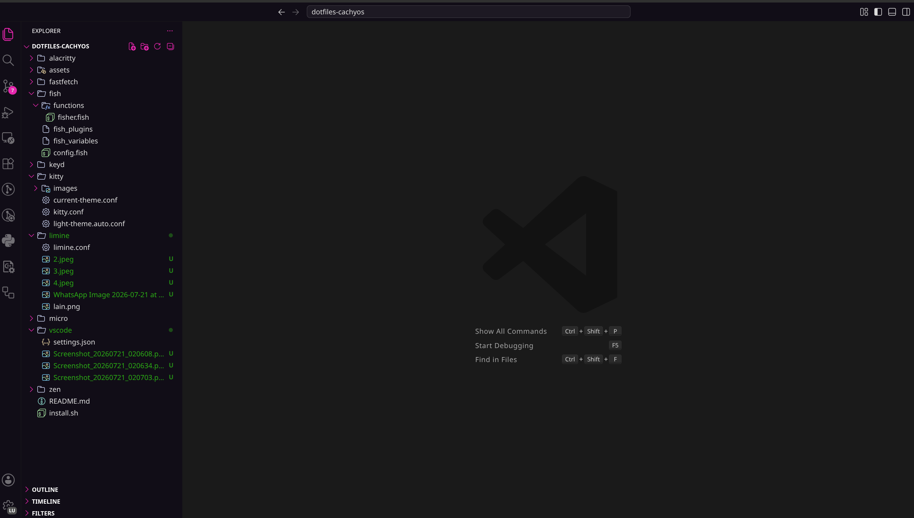
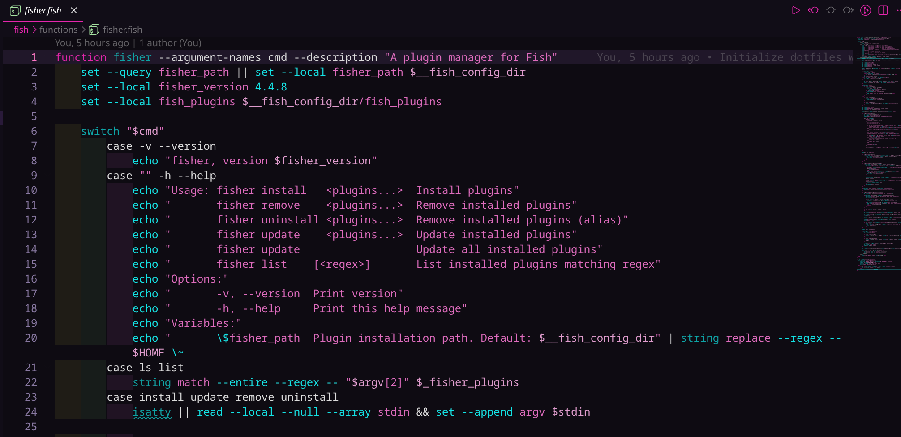
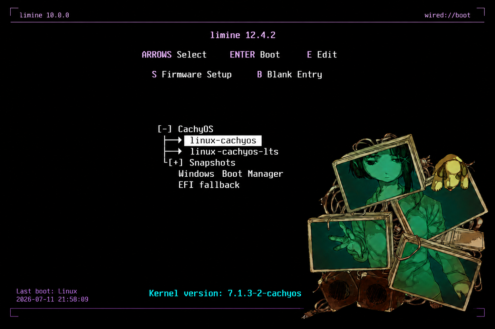
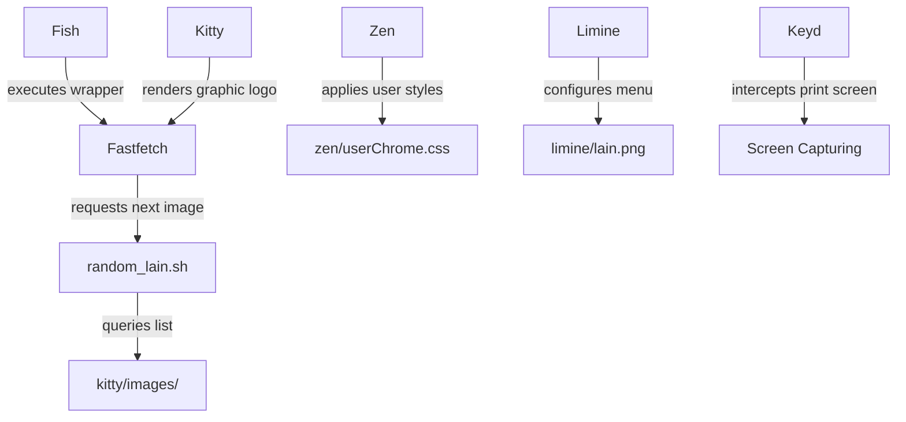

# dotfiles-cachyos 🍙

[](https://archlinux.org)
[](https://kde.org)
[](https://wayland.freedesktop.org)
[](https://fishshell.com)
[](https://sw.kovidgoyal.net/kitty/)
[](https://github.com/Limine-Bootloader/Limine)

Personal **CachyOS & Arch Linux rice** featuring custom ricing for KDE Plasma, Kitty, Fish shell avatar rotation, Fastfetch, Limine bootloader ricing, and a custom Lunar Pink VS Code theme.

---

## Showcase

### Kitty Terminal Ricing Previews

#### Individual Views (Detailed terminal ricing configurations)
<p align="center">
  
  
</p>

#### Split View (Four terminal instances showcasing dynamic ricing avatars)
<p align="center">
  
</p>

### Development Workspace Rice

A glimpse of the editor, terminal, and project structure using the Wired CachyOS ricing configuration.

<p align="left">
  
</p>

<p align="left">
    
  

 

</p>

<p align="center">
  
</p>

---

## Navigator

Select a destination node to jump directly to that section of the documentation:

```
                  [ Start Here ]
                        │
         ┌──────────────┴──────────────┐
         ▼                             ▼
  [ Install Rice ]              [ Explore Rice ]
         │                             │
         ▼                             ▼
[ Auto-Installation ]        [ Ricing Modules ] ───► [ Architecture ]
```

*   [**Start Here**](#requirements) - Check the list of system dependencies.
*   [**Install Rice**](#rice-installation--deployment) - View manual and automatic deployment steps for this rice.
*   [**Explore Rice**](#ricing-component-overview) - Read details about the custom ricing configs.
*   [**Auto-Installation**](#automatic-rice-installation) - Execute the one-line rice installer script.
*   [**Ricing Modules**](#ricing-component-overview) - Quick summary of each modified application in this rice.
*   [**Architecture**](#architecture-diagram) - Flow diagram showing how ricing modules interact.

---

## Requirements

Before cloning or applying this CachyOS rice configuration, ensure your system has the following dependencies installed:

### Core Packages
*   **kitty** - GPU-accelerated terminal emulator for terminal ricing.
*   **fish** - Shell environment with ricing plugins and script integration.
*   **fastfetch** - System information display tool for desktop ricing.
*   **keyd** - Key remapping daemon.
*   **limine** - Custom bootloader manager with background artwork ricing.

### Scripts & Helper Utilities
*   **bash** - Required by the fastfetch random image cycling script.
*   **fisher** - Fish shell plugin manager (to download ricing modules).
*   **imagemagick** (Optional) - Helper utility for visual preview processing scripts.

---

## Ricing Feature Grid

| Ricing Component | Key Ricing Feature | Configuration Path |
| :--- | :--- | :--- |
| **Kitty** | Transparent background, border glow, GPU image ricing support | `kitty/kitty.conf` |
| **Fish** | Fastfetch wrapper and dynamic avatar ricing rotation | `fish/config.fish` |
| **VS Code** | Custom Lunar Pink theme ricing and telemetry disabled | `vscode/settings.json` |
| **Limine** | Custom boot background image ricing | `limine/limine.conf` |
| **Zen Browser** | Full transparency and background blur ricing styling | `zen/userChrome.css` |
| **Keyd** | Hardware-level Print Screen capture remapping | `keyd/default.conf` |
| **Micro** | Catppuccin Macchiato syntax coloring ricing | `micro/settings.json` |

---

## Ricing Component Overview

### Kitty Terminal Ricing
*   **Styles:** Opacity 0.70, blur 128, active purple borders (#c084fc), borderless window decorations.
*   **Graphics:** Uses the Kitty icat protocol to print high-resolution inline terminal ricing images.

### Fish Shell & Avatar Ricing
*   **Fastfetch Wrapper:** Shuffles, loads, and displays dynamic avatar graphic logos on shell init for aesthetic ricing.
*   **Plugins:** Shell modules configured and managed via `fisher`.

### VS Code Theme Ricing
*   **Theme & Window:** Lunar Pink workbench custom ricing styling with native titlebars and disabled telemetry.

### Limine Bootloader Ricing
*   **Interface:** Configures boot menus, OS selections, and custom bootloader ricing background image rendering.

<p align="center">
  
</p>

### Zen Browser & Lock Screen Ricing
*   **Visuals:** Full transparency chrome rules and dynamic lock screen video backgrounds, based on [agridyne/dotfiles-dt](https://github.com/agridyne/dotfiles-dt).

### Keyd & Micro Editor Ricing
*   **Utilities:** Binds key events for screen capturing and sets Catppuccin Macchiato micro theme ricing.

---

## Architecture Diagram



---

## Technical Ricing Details

### Dynamic Image Fastfetch Ricing Logo
Whenever `fastfetch` is run (or a new Kitty terminal window is opened), the custom ricing wrapper function in Fish shell runs a bash script to cycle images:
```fish
function fastfetch
    set img (~/.config/fastfetch/random_lain.sh)
    kitten @ set-font-size 9
    command fastfetch --logo-type kitty-icat --logo $img $argv
    kitten @ set-font-size 14
end
```

The underlying bash script (`fastfetch/random_lain.sh`) rotates the images in a queue to ensure a new image displays on every execution:
```bash
#!/bin/bash

DIR="$HOME/.config/fastfetch/lain"
QUEUE="$HOME/.cache/lain_queue"

mkdir -p "$HOME/.cache"

if [ ! -s "$QUEUE" ]; then
    find "$DIR" -maxdepth 1 -type f \
        \( -iname "*.png" -o -iname "*.jpg" -o -iname "*.jpeg" -o -iname "*.webp" \) \
        | shuf > "$QUEUE"
fi

IMG=$(head -n1 "$QUEUE")
tail -n +2 "$QUEUE" > "$QUEUE.tmp"
mv "$QUEUE.tmp" "$QUEUE"

echo "$IMG"
```

### Limine Bootloader Ricing
The system boot sequence uses the Limine boot manager with a custom background image config (`limine/lain.png`). This bootloader ricing theme is loaded directly by placing the background assets inside `/boot/lain.png` and linking it inside `/boot/limine.conf`.

---

## Rice Installation & Deployment

### Automatic Rice Installation
You can automatically back up your existing configurations and apply this entire CachyOS rice with a single command:
```bash
curl -sL https://raw.githubusercontent.com/Wired-Navi0x17/dotfiles-cachyos/main/install.sh | bash
```

### Manual Rice Installation
Alternatively, symlink individual configuration folders manually to apply the rice:
```bash
# Kitty Terminal Rice
ln -sf ~/dotfiles-cachyos/kitty ~/.config/kitty

# Fish Shell Rice
ln -sf ~/dotfiles-cachyos/fish ~/.config/fish

# VS Code settings
mkdir -p ~/.config/Code/User
ln -sf ~/dotfiles-cachyos/vscode/settings.json ~/.config/Code/User/settings.json

# Alacritty Terminal
ln -sf ~/dotfiles-cachyos/alacritty ~/.config/alacritty

# Fastfetch settings
ln -sf ~/dotfiles-cachyos/fastfetch ~/.config/fastfetch

# Micro settings
ln -sf ~/dotfiles-cachyos/micro ~/.config/micro

# Zen userChrome (replace YOUR_PROFILE with your active profile folder)
mkdir -p ~/.config/mozilla/firefox/YOUR_PROFILE/chrome
ln -sf ~/dotfiles-cachyos/zen/userChrome.css ~/.config/mozilla/firefox/YOUR_PROFILE/chrome/userChrome.css
```

### System Ricing Configuration
To configure the bootloader background and hotkeys, copy configurations system-wide:

```bash
# Keyd configuration
sudo cp ~/dotfiles-cachyos/keyd/default.conf /etc/keyd/default.conf
sudo systemctl restart keyd

# Limine Bootloader settings
sudo cp ~/dotfiles-cachyos/limine/limine.conf /boot/limine.conf
sudo cp ~/dotfiles-cachyos/limine/lain.png /boot/lain.png
```

---

## References and Inspiration

*   **Styling & Ricing References:** Desktop video wallpaper background rules and Zen Browser transparency properties were implemented following specifications in the [agridyne/dotfiles-dt](https://github.com/agridyne/dotfiles-dt) repository.
*   **Copyright Disclaimer:** Some artwork included in this repository belongs to its respective artists and is provided for demonstration purposes. If requested by the copyright holder, the assets will be removed promptly.

