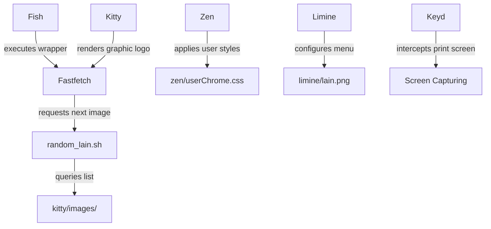

# dotfiles-cachyos

[](https://archlinux.org)
[](https://kde.org)
[](https://wayland.freedesktop.org)
[](https://fishshell.com)
[](https://sw.kovidgoyal.net/kitty/)
[](https://github.com/Limine-Bootloader/Limine)

---

## Showcase

### Kitty Terminal Previews

#### Individual Views (Detailed terminal configurations)
<p align="center">
  
  
</p>

#### Split View (Four terminal instances showcasing dynamic avatars)
<p align="center">
  
</p>

### VS Code Workspace Previews
Previews of the editor showing different sections of configurations and theme palettes:
<p align="center">
  
</p>
<p align="center">
  
  
</p>
<p align="center">
  
</p>

### Limine Bootloader Preview
The system boot manager interface featuring custom background artwork:
<p align="center">
  
</p>

---

## Interactive Navigator

Select a destination node to jump directly to that section of the documentation:

```
                  [ Start Here ]
                        │
         ┌──────────────┴──────────────┐
         ▼                             ▼
  [ Install Now ]               [ Explore Rice ]
         │                             │
         ▼                             ▼
[ Auto-Installation ]        [ Component Cards ] ───► [ Architecture ]
```

*   [**Start Here**](#requirements) - Check the list of system dependencies.
*   [**Install Now**](#installation) - View manual and automatic deployment steps.
*   [**Explore Rice**](#component-overview) - Read details about the custom configs.
*   [**Auto-Installation**](#automatic-installation) - Execute the one-line installer script.
*   [**Component Cards**](#component-overview) - Quick summary of each modified application.
*   [**Architecture**](#architecture-diagram) - Flow diagram showing how config modules interact.

---

## Requirements

Before cloning or applying these configurations, ensure your system has the following dependencies installed:

### Core Packages
*   **kitty** - GPU-accelerated terminal emulator.
*   **fish** - Shell environment.
*   **fastfetch** - System information tool.
*   **keyd** - Key remapping daemon.
*   **limine** - Boot manager.

### Scripts & Helper Utilities
*   **bash** - Required by the fastfetch random image cycle script.
*   **fisher** - Fish shell plugin manager (to download shell modules).
*   **imagemagick** - Required for visual preview processing scripts.

---

## Feature Grid

| Component | Key Feature | Configuration Path |
| :--- | :--- | :--- |
| **Kitty** | Transparent background, border glow, GPU image support | `kitty/kitty.conf` |
| **Fish** | Fastfetch wrapper and random image slide | `fish/config.fish` |
| **VS Code** | Custom Lunar Pink theme and telemetry disables | `vscode/settings.json` |
| **Limine** | Custom boot background image rendering | `limine/limine.conf` |
| **Zen Browser** | Full transparency and background blur styling | `zen/userChrome.css` |
| **Keyd** | Hardware-level Print Screen capture remapping | `keyd/default.conf` |
| **Micro** | Catppuccin Macchiato syntax coloring | `micro/settings.json` |

---

## Component Overview

### Kitty Terminal
*   **Transparency & Blur:** Custom `background_opacity 0.70` and `background_blur 128`.
*   **Border Glow:** Mapped active purple highlights (`#c084fc`) and dark inactive borders (`#3b1f4a`).
*   **GPU Images:** Employs the Kitty graphics `icat` protocol to draw images inside the terminal.
*   **Window Rules:** Hides OS close/minimize decorations for a borderless aesthetic.

### Fish Shell
*   **Fastfetch Wrapper:** Intercepts `fastfetch` command to resize terminal font and insert custom avatars.
*   **Slide Randomizer:** Runs a background bash script to grab a shuffled image on every execution.
*   **Fisher Plugins:** Integrated plugin list configured in `fish_plugins`.

### VS Code
*   **Colorscheme:** Custom Lunar Pink interface coloring configuration.
*   **Telemetry:** Disabled Microsoft telemetry and spelling diagnostics.
*   **Windowing:** Mapped custom native titlebars and profiles.

### Limine Bootloader
*   **Theme:** Custom bootloader menu layout showing boot options.
*   **Background:** Custom background image `lain.png` loaded directly from `/boot/lain.png`.
*   **Behavior:** Set timeout durations and default OS selection rules.

### Zen Browser & Lock Screen
*   **Zen Styles:** Full translucent browser background utilizing `userChrome.css` rules.
*   **Lock Screen:** Background video integration configured in KDE settings.
*   **Inspirations:** Followed the styling and configuration guides from the [agridyne/dotfiles-dt](https://github.com/agridyne/dotfiles-dt) repository.

### Keyd & Micro Editor
*   **Keyd Mappings:** Mapped selective screen capturing to the Print Screen key globally.
*   **Micro Editor:** Integrated Catppuccin Macchiato colorscheme for syntax highlighting.

---

## Architecture Diagram



---

## Technical Details

### Dynamic Image fastfetch Logo
Whenever `fastfetch` is run (or a new Kitty terminal window is opened), the custom wrapper function in Fish shell runs a bash script to cycle images:
```fish
function fastfetch
    set img (~/.config/fastfetch/random_lain.sh)
    kitten @ set-font-size 9
    command fastfetch --logo-type kitty-icat --logo $img $argv
    kitten @ set-font-size 14
end
```

The underlying bash script (`fastfetch/random_lain.sh`) rotates the images in a queue to ensure a new image displays on every execution:
```bash
#!/bin/bash

DIR="$HOME/.config/fastfetch/lain"
QUEUE="$HOME/.cache/lain_queue"

mkdir -p "$HOME/.cache"

if [ ! -s "$QUEUE" ]; then
    find "$DIR" -maxdepth 1 -type f \
        \( -iname "*.png" -o -iname "*.jpg" -o -iname "*.jpeg" -o -iname "*.webp" \) \
        | shuf > "$QUEUE"
fi

IMG=$(head -n1 "$QUEUE")
tail -n +2 "$QUEUE" > "$QUEUE.tmp"
mv "$QUEUE.tmp" "$QUEUE"

echo "$IMG"
```

### Limine Bootloader
The system uses the Limine bootloader with a custom background image (`limine/lain.png`). Here is the bootloader layout:

<p align="center">
  
</p>

---

## Installation

### Automatic Installation
You can automatically back up your existing configurations and symlink all files in this repository with a single command:
```bash
curl -sL https://raw.githubusercontent.com/Wired-Navi0x17/dotfiles-cachyos/main/install.sh | bash
```

### Manual Installation
Alternatively, symlink individual configuration folders manually:
```bash
# Kitty Terminal
ln -sf ~/dotfiles-cachyos/kitty ~/.config/kitty

# Fish Shell
ln -sf ~/dotfiles-cachyos/fish ~/.config/fish

# VS Code settings
mkdir -p ~/.config/Code/User
ln -sf ~/dotfiles-cachyos/vscode/settings.json ~/.config/Code/User/settings.json

# Alacritty Terminal
ln -sf ~/dotfiles-cachyos/alacritty ~/.config/alacritty

# Fastfetch settings
ln -sf ~/dotfiles-cachyos/fastfetch ~/.config/fastfetch

# Micro settings
ln -sf ~/dotfiles-cachyos/micro ~/.config/micro

# Zen userChrome (replace YOUR_PROFILE with your active profile folder)
mkdir -p ~/.config/mozilla/firefox/YOUR_PROFILE/chrome
ln -sf ~/dotfiles-cachyos/zen/userChrome.css ~/.config/mozilla/firefox/YOUR_PROFILE/chrome/userChrome.css
```

### System Configuration
To configure the bootloader background and hotkeys, copy configurations system-wide:

```bash
# Keyd configuration
sudo cp ~/dotfiles-cachyos/keyd/default.conf /etc/keyd/default.conf
sudo systemctl restart keyd

# Limine Bootloader settings
sudo cp ~/dotfiles-cachyos/limine/limine.conf /boot/limine.conf
sudo cp ~/dotfiles-cachyos/limine/lain.png /boot/lain.png
```

---

## References and Inspiration

*   **Styling References:** Desktop video wallpaper background rules and Zen Browser transparency properties were implemented following specifications in the [agridyne/dotfiles-dt](https://github.com/agridyne/dotfiles-dt) repository.
*   **Copyright Disclaimer:** Some artwork included in this repository belongs to its respective artists and is provided for demonstration purposes. If requested by the copyright holder, the assets will be removed promptly.
